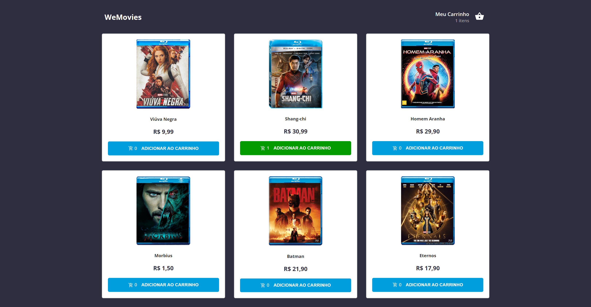

# WeMovies - WeFit test

<table>
    <tr>
    <th style="border: 1px solid #000">
            Web Interface - Desktop
        </th>
        <th style="border: 1px solid #000">
            Web Interface - Mobile
        </th>
    </tr>
    <tr>
        <td style="border: 1px solid #000">
            
        </td>
        <td width="25%" style="border: 1px solid #000">
            
        </td>
    </tr>
</table>

## Features

#### Home

- The movies are displayed after making a request to the API.
- Users can add the listed movies to the cart.
- Users can see the total sum of items that have been added to the cart.

#### Cart

- Users can view the items added to the cart.
- The total value is calculated based on each item added.
- Users can remove items from the cart.
- If the cart is empty, an "empty" screen is displayed with the option to go back to the home screen.

#### Purchase Confirmation

- After confirming the order on the previous screen, the user is redirected to the order confirmed screen.
- Here, the user also has the option to go back to the home screen.

## 🚀 How to run

```bash
# Clone the project and access its folder.
$ git clone https://github.com/JuniorAlvess/wefit-test
$ cd wefit-test
```

```bash
# To start the project
$ pnpm i
$ pnpm dev
# open [Localhost](http://localhost:5173/) in browser
```

- Open [Localhost](http://localhost:5173/) in browser.

## Technologies

This project was developed with the following technologies

- [TypeScript](https://www.typescriptlang.org/)
- [Vite](https://vitejs.dev/)
- [PNPM](https://pnpm.io/pt/)
- [React](https://reactjs.org)
- [Axios](https://axios-http.com/)
- [Styled-components](https://styled-components.com/)
